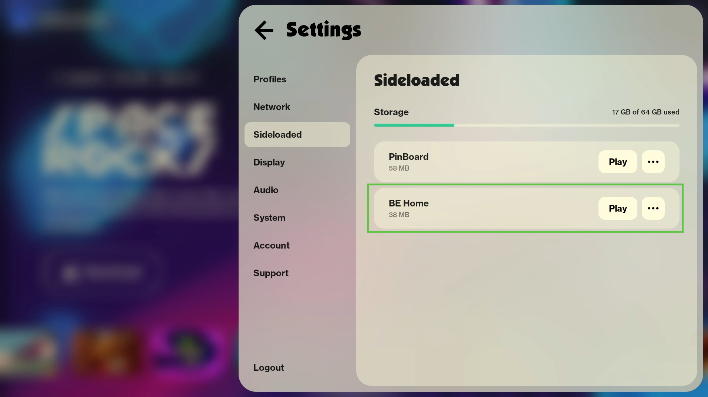

# Board Enthusiasts (BE) Home for Board

The *BE Home* app is your one-stop on-Board shop for all things Board Enthusiasts has to offer on the Board device itself!.

## Dependencies

This Unity project has several external dependences that must be installed before it will compile:

- [Board SDK](https://dev.board.fun)
- [Rahmen](https://github.com/matt-stroman/Rahmen)
	- Base, Data, and Events packages
- [BE GDK for Board](https://github.com/board-enthusiasts/unity-tools)
- [BE Emulator for Board](https://github.com/board-enthusiasts/unity-tools)

## How to Install

> [!NOTE] **Board OS Firmware**
> This install process requires Board OS v1.6.2+.

1. Build targeting Android.
2. Open a terminal in the output build folder.
3. Ensure your Board is connected to your PC and `bdb status` reports connected and ready.
3. Run `bdb install "your-apk-name.apk"`
4. On Board, open Settings -> Sideloaded and press `Play` to launch *BE Home*.

